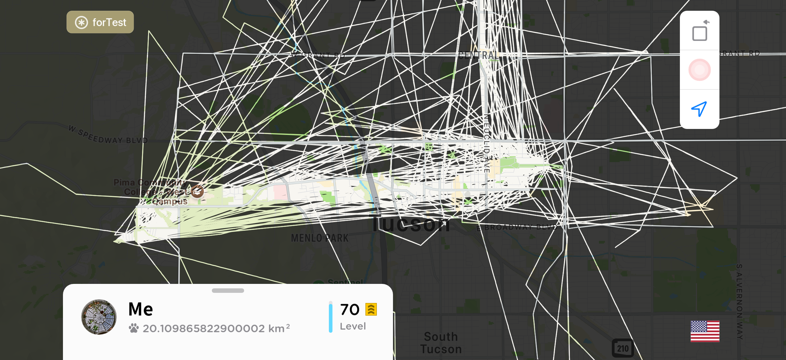
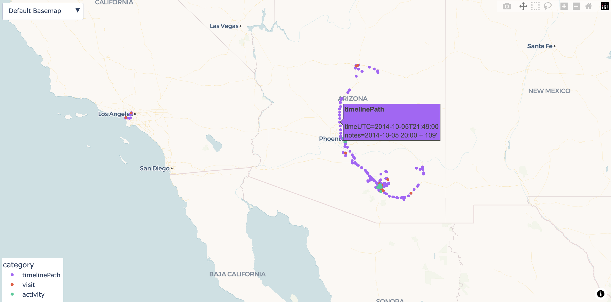

# google-maps-timeline-to-fow
| File / Folder | About |
| --- | --- |
| ***google-maps-timeline-to-fow.ipynb*** | the script
| ***location-history.json*** | sample data - replace with your own
| ***output*** | the output folder with sample output files using the sample data

## **Google Maps Timeline to Fog of World Converter**

This script converts the exported **Google Maps Timeline** data (*location-history.json*) into a **GPX file of location points** to be imported to **Fog of World**.

### **Why Points:**

All data from the Google Maps Timeline location history, including paths, **will be extracted to points** due to the inaccuracy of the timeline paths: the paths simply connect the recorded points, so the lines often jump across buildings instead of being drawn along the roads.

**❌** If import **paths** to FoW:

**✅ SOLUTION:** import extracted **points**:

**To restore paths:** 
Connect points manually in the app: *Settings → Database → Track Editor* (*or long-pressing the map menu icon*). 
**Optional:** Use the generated interactive map ***timeline-map.html*** or the [Google Maps Timeline Viewer](https://github.com/ry-li/google-maps-timeline-viewer) as a reference.

### **Original Data:**
Google Maps Timeline data has four categories:

| Category | Geo Data | For |
| :-: | --- | --- |
| ***visit*** | point | places visited |
| ***activity*** | start point + end point | activities like *walking*, *cycling*, *in subway*, etc., from one point to another |
| ***timelinePath*** | collection of all recorded points along the path | movements paths |
| ***timelineMemory*†** | n/a | records for distant destinations (?) |

† *timelineMemory* will be discarded

### **Output Files:**
1. ***timeline.gpx*** → GPX tracks†† to be imported to Fog of World
2. ***timeline.csv*** → CSV table of all extracted points with time††† (in UTC), coordinates, category, and notes†††
3. ***timeline-map.html*** → an interactive Plotly map

†† Fog of World can't read points from the GPX file. Each point will add a small offset (1e-6) to form a short track for usability by FoW.

††† *time* and  *notes* vary by category:

| Category | timeUTC | notes | notes exapmle |
| :-: | --- | --- | --- |
| ***visit*** | start time | calculated duration of the visit (end time - start time) | duration: 0.73 h |
| ***activity*** | start time if is the start point; end time if is the end point | is start or end point | start |
| ***timelinePath*** | calculated timestamp of this point | minutes offset from path start time (in whole hours) | 2013-05-03 18:00 + 74' |

### **Interactive Map Preview:**
Sample map *output/timeline-map.html* generated using sample data 
https://r-li.com/google-maps-timeline-to-fow

## **Before Runing the Script:**
### Replace the sample *location-history.json* file with your own. Make sure the *location-history.json* file and the *google-maps-timeline-to-fow.ipynb* file are in the same directory.
